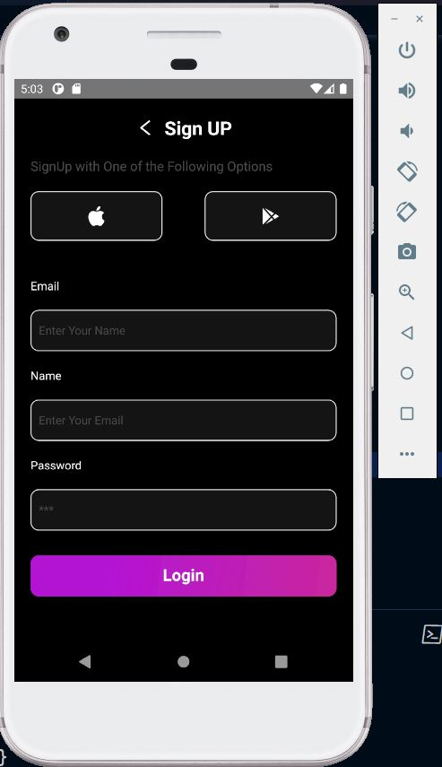
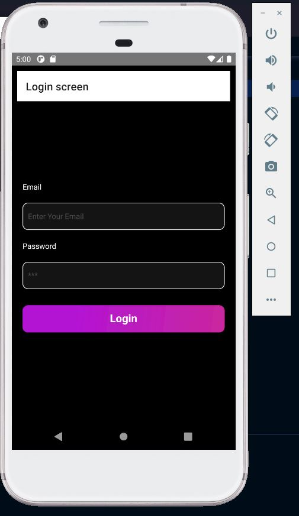
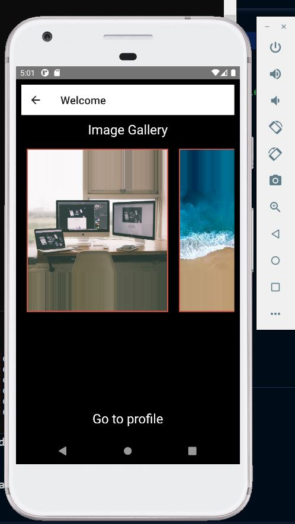
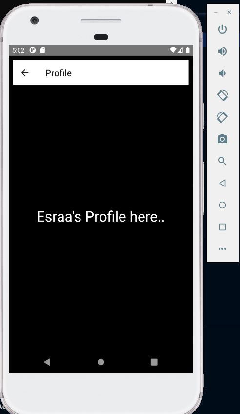

# React Native Labs

You can Download my source code from *main-branch* [https://github.com/EsraaYousef/ReactNativeApp].
To get started Please:
* install all project dependencies with `npm install`
* 
## Contents
    * `Lab 1` --> Register page Found in App-01.js file. 
        
    * `Lab 2` 
            ├── Login page as Initial Screen.
                
            ├── Home page Page contains FlatList to render list of Images.
                
            └── Profile Page.
                
